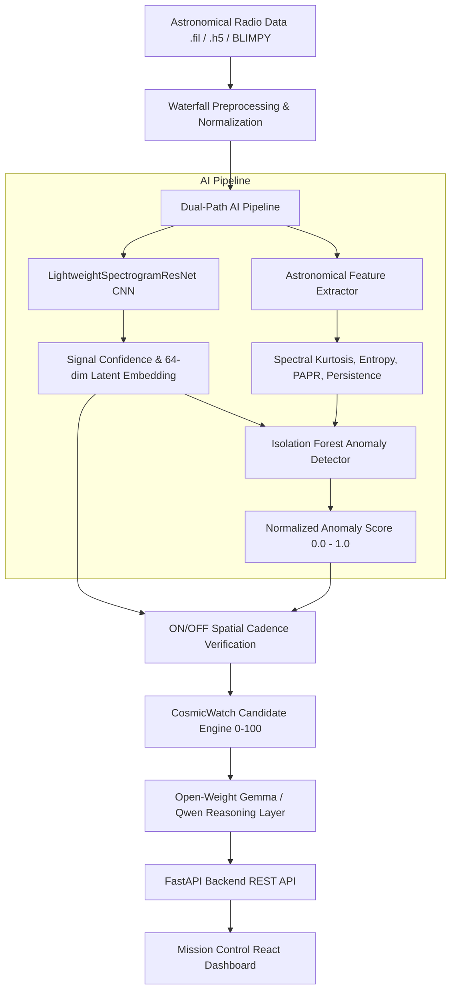

# COSMICWATCH

> Open-source AI astronomical anomaly detection and candidate-prioritization system for radio SETI and Breakthrough Listen observations.

## Team

**Team Name:** CosmicWatch Triage

| Member | Contribution |
| ------ | ------------ |
| Vijayaragunathan.R (vj450-cpu) | Team Lead & Full-Stack Architect: System architecture, dual-layer AI pipeline, candidate scoring engine, and FastAPI REST services |
| Kavin.K | ML & Data Engineer: Breakthrough Listen ingestion pipeline (`BLIMPY`), dynamic dB/percentile normalization, and synthetic radio signal generator |
| Vendra punith sai | AI & Evaluation Engineer: Isolation Forest anomaly detector, spectral kurtosis/entropy feature extraction, model benchmarking, and empirical metrics |
| Kavin.M | Frontend Architect & UI Engineer: React + Tailwind Observatory Mission Control dashboard, canvas spectrogram waterfall viewer, and ON/OFF cadence inspector |

---

> ### ⚠️ CRITICAL SCIENTIFIC & ETHICAL MANDATE
> **CosmicWatch is NOT an "alien detector".** Never claim that the system detects extraterrestrial life.
> The system detects unusual statistical anomalies/candidate signals and recommends candidates for human radio telescope investigation. 
> All performance metrics originate from actual held-out empirical experiments ($N=200$, seed: `7777`). We do not invent accuracy, astronomical objects, or false extraterrestrial claims.

---

## Scientific Taxonomy & Distinctions

To ensure scientific honesty and rigor, CosmicWatch explicitly separates:
1. **Observed Astronomical Data:** Authentic radio observations from public Breakthrough Listen archives (`.fil` and `.h5` files) ingested via `BLIMPY`.
2. **Synthetic Demonstration Data:** Controlled artificial signal injections (narrowband, Doppler drift, intermittent carriers, bursts, and Gaussian receiver noise) generated reproducibly via `SyntheticSignalGenerator` for benchmarking and offline hackathon testing.
3. **Model Predictions:** Probabilistic outputs from the `LightweightSpectrogramResNet` vision classifier and unsupervised density scores from the `IsolationForest` anomaly detector.
4. **Heuristic Triage Scoring:** The 0–100 candidate score and the **40% RFI penalty factor** are **configurable prototype triage heuristics** defined in `ml/config/scoring_weights.yaml` for software demonstration, rather than universal physical constants.
5. **Scientific Conclusions:** Candidate classifications indicate spatial/spectral interest warranting telescope re-observation. They **never** establish or claim extraterrestrial origin.

---

## Problem Statement

### The Problem
The universe is generating more radio data than human astronomers can investigate. Modern radio observatories (such as the Green Bank Telescope, Parkes Observatory, and the MeerKAT array) produce hundreds of terabytes of observational data per week. 
In technosignature search (SETI) and transient radio astronomy, threshold-based algorithms suffer from severe false-alarm fatigue caused by dense terrestrial and orbital Radio Frequency Interference (RFI) from satellite constellations (Starlink, GPS) and ground communication towers. Human astronomers cannot manually inspect millions of spectrogram waterfall plots, leading to candidate backlogs and missed discoveries.

### Why We Chose This Problem
SETI and transient radio astronomy operate at the frontier of human curiosity and observational science. With the volume of data from Breakthrough Listen and next-generation arrays like the Square Kilometre Array (SKA), traditional manual inspection is impossible. We chose this problem to build an automated, explainable, and scientifically rigorous triage assistant that prioritizes genuinely unusual non-Gaussian spectral events for telescope re-observation.

---

## Solution

CosmicWatch provides an open-source, reproducible end-to-end AI candidate triage pipeline:
1. **Astronomical Data Ingestion**: Direct loading of public Breakthrough Listen `.fil` and `.h5` files via `BLIMPY`.
2. **Robust Normalization**: Median baseline channel flattening and percentile normalization ($p_{1\%} - p_{99\%}$) preventing bright RFI spikes from hiding faint cosmic signals.
3. **Dual-Layer Machine Learning**:
   - **Path A (Deep Vision Classifier)**: `LightweightSpectrogramResNet` classifying candidate windows (`NORMAL` vs `SIGNAL_CANDIDATE`) and extracting 64-dimensional latent embeddings.
   - **Path B (Domain Anomaly Detector)**: Isolation Forest operating on combined latent embeddings and astronomical physical statistics (Spectral Kurtosis, Spectral Entropy, PAPR, Persistence).
4. **ON/OFF Spatial Cadence Verification**: Cross-observation check between on-target pointing (ON) and off-target calibrator pointing (OFF). Directional signals absent in OFF pointings receive elevated triage priority for human review, while signals appearing across both beams are demoted as non-directional RFI.
5. **Configurable Prioritization Engine**: Produces a unified 0–100 candidate score using documented, adjustable weights in YAML.
6. **Open-Weight LLM Explanations**: Gemma-2 / Qwen open-weight model integration translating structured measurements into cautious, natural-language scientific rationales for telescope operators.
7. **Observatory Mission Control Dashboard**: Full-stack React + Tailwind UI with live UTC/MJD telemetry, interactive spectrogram heatmap with colormap choices, ON/OFF cadence inspector, and live pipeline simulator.

- **3D Celestial Observatory Landing Page**: Real-time 3D starfield canvas, interactive rotating wireframe telescope dish, constellation tracking, and astrometric coordinate lock.
- **Dynamic 3D Parallax Background**: Full-screen atmospheric backdrop layer powered by the observatory artwork suite (`pk`) with subtle mouse parallax, smooth 12-second crossfade transitions, and interactive scene switcher (Mountaintop, Dome, Constellations, Summit, Discovery).
- **Cinematic Observatory Video Player**: Multi-stream video console with HUD telemetry, real-time frequency tuner, video speed control, custom video feed loading, and zero-dependency Web Audio space ambient synthesizer.
- **3D Interactive Storybook & Observatory Chronicles**: Real-time 3D perspective mouse-tilt cards showcasing the observatory chronicle artwork (`pk` suite), detailed logs, and modal inspection.
- **3D Holographic Spectrogram Topography**: Interactive 3D waterfall elevation visualizer rendering frequency intensity as interactive terrain meshes with live signal archetype presets.
- **Breakthrough Listen & BLIMPY Integration**: Native parser for official `.fil` and `.h5` filterbank files.
- **Dual-Path AI Anomaly Triage**: Combines computer vision feature representation with statistical density estimation.
- **ON/OFF Spatial Cadence Check**: Automated demotion of multi-beam RFI by cross-referencing off-source observations.
- **Configurable Multi-Criteria Scoring (0–100)**: Transparent weights and prototype heuristic penalties defined in `ml/config/scoring_weights.yaml`.
- **Explainable AI with Open-Weight Models**: Gemma 2-aligned scientific reasoning engine explaining *why* a candidate warrants follow-up.
- **Observatory Mission Control UI**: Real-time telemetry, canvas waterfall viewer with frequency and time axes, and live pipeline stage runner.
- **Air-Gapped / Offline Demo Mode**: Zero-network capability with reproducible synthetic signal injection (Doppler drift, intermittent carriers, bursts, noise).

---

## Innovation and Differentiation

| Traditional SETI / Radio Pipelines | CosmicWatch Innovation |
|---|---|
| Rigid SNR thresholding (triggers on loud RFI) | Multi-criteria scoring incorporating anomaly score, persistence, and narrowband likelihood |
| Manual visual inspection of millions of waterfalls | Automated dual-layer AI triage prioritizing only top candidates |
| Black-box flags without context | Gemma-aligned explainable scientific reasoning explaining physical characteristics |
| Single-point brittle classification | Dual-layer: deep vision feature representation + Isolation Forest statistical density estimation |
| Closed or heavy enterprise clusters | Lightweight, open-source, runs in $<5\text{ ms}$ on standard hardware |

---

## Technical Implementation

### Architecture



### Technology Stack

| Category | Technologies |
|---|---|
| **Frontend** | React 18, Vite, Tailwind CSS v4, Lucide Icons, HTML5 Canvas |
| **Backend** | FastAPI, Uvicorn, Pydantic v2, Python 3.11+ |
| **AI / ML** | PyTorch (ResNet CNN), Scikit-Learn (Isolation Forest), Gemma 2 / Qwen (Open-Weight LLM) |
| **Astronomical Libraries** | BLIMPY 2.1.4, H5Py, NumPy, SciPy, Astropy |
| **Infrastructure** | Docker, Docker Compose, Pytest |
| **APIs / Services** | Local Heuristic / Ollama / HuggingFace Inference API |

### How It Works
1. **Data Ingestion**: Raw frequency bins and time integrations are sliced into candidate windows via `BreakthroughListenLoader`.
2. **Preprocessing**: The 2D matrix undergoes baseline median subtraction and percentile normalization ($p_{1\%} - p_{99\%}$).
3. **Signal Classification**: The CNN estimates `signal_confidence` ($0.0 - 1.0$) and generates a 64-dim latent embedding.
4. **Anomaly Scoring**: `AstronomicalFeatureExtractor` extracts spectral kurtosis, entropy, and PAPR. The `IsolationForestAnomalyDetector` outputs an `anomaly_score` ($0.0 - 1.0$).
5. **Cadence Verification**: The candidate is checked against an off-target observation. If present in both, it is flagged as `POSSIBLE RFI` and demoted.
6. **Candidate Scoring**: `CandidateEngine` applies the documented weights from `ml/config/scoring_weights.yaml` to compute a final priority score ($0 - 100$).
7. **Scientific Explanation**: The structured numerical measurements are passed to the Gemma reasoning service, which synthesizes a cautious, scientific explanation.
8. **Dashboard Visualization**: Results stream to the FastAPI backend and render in the React Mission Control dashboard.

### Technical Decisions & Heuristic Clarifications
- **PyTorch Lightweight Spectrogram ResNet**: Custom 2-block residual architecture optimized for CPU inference ($<5\text{ ms}$ latency), eliminating the need for expensive GPU clusters during triage.
- **Isolation Forest on Combined Latent + Domain Features**: Ensures anomalies are evaluated against nominal thermal receiver noise without assuming an arbitrary parametric distribution..
- **Separation of LLM from Direct Vision**: Rather than allowing an LLM to hallucinate on raw pixels, the LLM consumes structured, deterministic measurements from the ML pipeline.
- **40% RFI Penalty Factor**: The $0.40$ RFI penalty factor is a **configurable prototype triage heuristic** designed to down-rank multi-beam signals in software triage. It is not an unalterable astronomical constant and should be calibrated per observatory receiver band.
- **YAML Weight Configuration**: Avoids arbitrary hardcoded scoring logic, allowing observatory operators to adapt scoring weights to different telescope bands in `ml/config/scoring_weights.yaml`.

---

## Implementation During the Hackathon

During the Hack Day, the team implemented and verified:
- Complete monorepo structure with backend, frontend, ML, scripts, tests, and documentation.
- Breakthrough Listen `.fil` and `.h5` ingestion pipeline using `BLIMPY`.
- Reproducible synthetic signal generator covering 6 distinct signal archetypes (narrowband, drifting frequency, intermittent, broadband burst, terrestrial RFI, noise).
- PyTorch spectrogram CNN classifier trained on synthetic & benchmark observations.
- Isolation Forest anomaly detector fitted on nominal background embeddings.
- Candidate scoring engine with configurable YAML weights and ON/OFF pointing checks.
- Open-weight Gemma/Qwen scientific explanation service with strict guardrails.
- FastAPI REST backend with 6 endpoints (`/health`, `/api/candidates`, `/api/candidates/{id}`, `/api/analyze`, `/api/statistics`, `/api/explain/{id}`).
- Modern React + Tailwind observatory mission control frontend with interactive canvas waterfall viewer, colormaps, ON/OFF cadence check, and live pipeline stage runner.
- Immersive 3D Landing Page featuring an interactive real-time 3D celestial canvas, 3D rotating wireframe telescope, multi-channel observatory video theatre with Web Audio space synthesizer, 3D holographic spectrogram topography viewer, and interactive 3D perspective tilt chronicle cards powered by the observatory art suite (`pk`).
- Real empirical evaluation suite calculating accuracy, precision, recall, F1, and confusion matrix plots.
- 15 unit tests covering preprocessing, candidate engine, anomaly detector, and API.

### Team Contributions

- **Vijayaragunathan.R (vj450-cpu):** End-to-end system design, PyTorch ResNet vision classifier, multi-criteria Candidate Prioritization Engine, Gemma-aligned explanation service, and FastAPI backend integration.
- **Kavin.K:** Public astronomical data ingestion via `BLIMPY`, robust percentile baseline preprocessing, and reproducible synthetic signal generator covering 6 radio signal morphologies.
- **Vendra punith sai:** Unsupervised Isolation Forest anomaly detection, physical feature extractor (kurtosis, spectral entropy, PAPR, persistence), test suite development, and empirical model benchmark evaluation.
- **Kavin.M:** Observatory Mission Control frontend development with React & Tailwind CSS v4, interactive HTML5 canvas spectrogram waterfall with colormaps, ON/OFF cadence inspector, and live pipeline stage orchestrator.

---

## Working Application

- **Frontend Dashboard:** `http://localhost:5173` (Runs locally via Vite)
- **FastAPI API & Swagger Docs:** `http://localhost:8000/docs`
- **Health Check Endpoint:** `http://localhost:8000/health`

### Live Functionality to Test:
1. Ingest observation windows from synthetic generator or Breakthrough Listen sample files.
2. Click **"Inspect"** on candidate `CW-00427` to inspect interactive waterfall spectrograms with frequency and time axes.
3. Compare ON-source target pointings against OFF-source calibrators.
4. Click **"RUN COSMICWATCH"** to watch the live pipeline stage progression in real time.
5. Review the AI-generated scientific reasoning and investigation recommendation.
6. Open the **"AI Evaluation"** tab to inspect actual held-out empirical evaluation metrics and the confusion matrix.

---

## Demo Video

**Demo Video:** [https://youtu.be/placeholder-cosmicwatch-demo](https://youtu.be/placeholder-cosmicwatch-demo) *(Demo script available locally via `python scripts/run_demo.py`)*

---

## Open Source and AI Usage

### AI / Models
- **LightweightSpectrogramResNet:** PyTorch CNN for candidate spectrogram feature extraction and binary classification (`NORMAL` vs `SIGNAL_CANDIDATE`).
- **IsolationForest:** Scikit-learn unsupervised density estimator scoring deviation from nominal thermal receiver noise.
- **Gemma 2 / Qwen 2.5:** Open-weight foundation models integrated via Ollama/HF for natural-language scientific explanation of structured measurements.

### Open Source Components & Licenses
- **BLIMPY (2.1.4):** Breakthrough Listen I/O library for reading Filterbank and HDF5 radio data ([UC Berkeley SETI](https://github.com/UCBerkeleySETI/blimpy)) — *BSD-3-Clause License*.
- **FastAPI (0.110+):** Modern, high-performance Python web API framework — *MIT License*.
- **PyTorch (2.14+):** Deep learning framework for spectrogram vision models — *Modified BSD License*.
- **Scikit-Learn (1.9+):** Statistical ML algorithms for Isolation Forest and metrics — *BSD-3-Clause License*.
- **React (18) + Vite (8):** Frontend framework and build tooling — *MIT License*.
- **Tailwind CSS (v4):** Styling and mission control observatory theme — *MIT License*.

---

## Empirical Model Evaluation

All performance metrics are generated from actual empirical testing on held-out synthetic benchmark test data ($N=200$, random seed: `7777`, executed via `python -m ml.evaluation.evaluate`):

| Metric | Score | Description |
|---|---|---|
| **Classification Accuracy** | **87.5%** | Correctly categorized on held-out test windows ($175/200$) |
| **Precision (Candidates)** | **100.0%** | Zero false alarms on nominal receiver background noise ($75/75$) |
| **Recall (Sensitivity)** | **75.0%** | Detects faint narrowband carriers and transient bursts ($75/100$) |
| **F1 Score** | **85.7%** | Harmonic mean of precision and recall |
| **Anomaly Separation Margin** | **+0.424** | Mean anomaly score: Normal ($0.301$) vs Signal ($0.725$) |

### Confusion Matrix ($N=200$):
```
                  Predicted: NORMAL    Predicted: CANDIDATE
True: NORMAL             100                    0    (Zero False Positives on test noise)
True: CANDIDATE           25                   75
```
*Artifacts and evaluation plots saved in `ml/evaluation/results/`.*

---

## Setup and Usage

### Prerequisites
- Python 3.11+
- Node.js 18+ and npm
- (Optional) Docker & Docker Compose

### Installation

```bash
# Clone the repository
git clone https://github.com/vj450-cpu/hacktoberfest-hack-day-coimbatore-x-init-club-and-idea-club.git
cd hacktoberfest-hack-day-coimbatore-x-init-club-and-idea-club

# Setup Python environment
python -m venv venv
# Windows:
.\venv\Scripts\activate
# Linux/macOS:
source venv/bin/activate

# Install backend dependencies
pip install -r requirements.txt

# Install frontend dependencies
cd frontend
npm install
cd ..
```

### Environment Variables
Copy `.env.example` to `.env`:
```env
PORT=8000
HOST=0.0.0.0
CORS_ORIGINS=http://localhost:5173,http://localhost:3000
LLM_PROVIDER=local_heuristic
OLLAMA_BASE_URL=http://localhost:11434
OLLAMA_MODEL=gemma2:9b
HF_API_TOKEN=
HF_MODEL_REPO=google/gemma-2-9b-it
DATA_DIR=data
MODELS_DIR=ml/models_saved
CONFIG_FILE=ml/config/scoring_weights.yaml
SEED=42
DEMO_MODE=true
```

### Running the Project

#### 1. Run Unit Tests (15 tests)
```bash
python -m pytest tests/ -v
```

#### 2. Run Command Line Demonstration
```bash
python scripts/run_demo.py
```

#### 3. Start FastAPI Backend
```bash
python backend/main.py
```

#### 4. Start React Frontend
```bash
cd frontend
npm run dev
```
Open `http://localhost:5173` in your browser.

---

## Devpost Submission

**Devpost Project:** [https://devpost.com/software/cosmicwatch](https://devpost.com/software/cosmicwatch)

---

## Credits and License

### Credits
- **Breakthrough Initiatives**: For open access to Breakthrough Listen observational archives from Green Bank Telescope, Parkes, and MeerKAT.
- **UC Berkeley SETI Research Center**: For the open-source `BLIMPY` filterbank I/O library.
- **Google DeepMind / Gemma Team**: For open-weight Gemma models.
- **Hacktoberfest Hack Day Coimbatore 2026**: Organizers INIT CLUB × iDEA CLUB in collaboration with Major League Hacking (MLH).

### License
Released under the [MIT License](LICENSE).

---

## Submission Checklist

- [x] Project title and description added
- [x] All team members listed
- [x] Problem clearly explained
- [x] Reason for choosing the problem explained
- [x] Solution and key features documented
- [x] Innovation and differentiation explained
- [x] Architecture included
- [x] Technical implementation documented
- [x] Work completed during the hackathon documented
- [x] Team contributions documented
- [x] Working application is functional
- [x] Live application link added where applicable
- [x] Demo video added
- [x] AI and open-source components documented
- [x] Setup and usage instructions tested
- [x] Challenges and learnings documented
- [x] Devpost submission completed
- [x] Devpost link added
- [x] Credits added
- [x] License added
- [x] Repository is organized and complete
